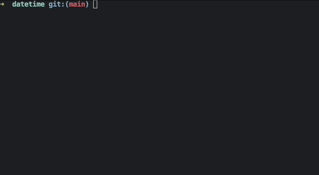

# bubble-datetime-picker

This repository contains a Go implementation of a terminal-based hour selector model using the Bubble Tea framework. The model allows users to increment and decrement hours, minutes, and seconds, and navigate between them using keyboard input. It’s designed to be a simple and intuitive component for terminal user interfaces (TUIs).

## Examples

### datetime picker



### hours picker


## Installation

To install the package, run the following command:

```bash
go get github.com/lcc/bubble-datetime-picker
```

## Usage

### Import the Package

First, import the package in your Go project:

```go
import (
    "github.com/lcc/bubble-datetime-picker"
)
```

### Initialize the Model

You can initialize the `dateAndHourModel` and use it in your Bubble Tea application:

```go
model := NewDateAndHourModel()
```

### Example Code

Here’s a basic example of how to integrate the datetime picker into your Bubble Tea program:

```go
package main

import (
    "fmt"
    tea "github.com/charmbracelet/bubbletea"
    dtPicker "github.com/lcc/bubble-datetime-picker"
)

func main() {
    p := tea.NewProgram(dtPicker.NewDateAndHourModel())
    if err := p.Start(); err != nil {
        fmt.Println("Error running program:", err)
    }
}
```

## Contributing

Contributions are welcome! If you find a bug or have a feature request, please open an issue or submit a pull request.

## License

This project is licensed under the MIT License. See the [LICENSE](LICENSE) file for more details.

## Acknowledgments

Special thanks to the [Bubble Tea](https://github.com/charmbracelet/bubbletea) framework for providing an excellent foundation for building terminal UIs. A huge shoutout to Ethan Fung and his [calendar UI](https://github.com/EthanEFung/bubble-datepicker) for laying the groundwork that made this project possible. Your contributions have been invaluable in bringing this datetime picker to life.